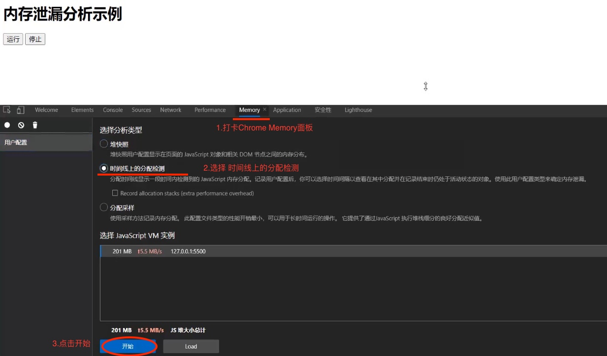

<!--
 * @Author: your name
 * @Date: 2022-02-25 11:15:04
 * @LastEditTime: 2022-02-25 14:49:38
 * @LastEditors: Please set LastEditors
 * @Description: 打开koroFileHeader查看配置 进行设置: https://github.com/OBKoro1/koro1FileHeader/wiki/%E9%85%8D%E7%BD%AE
 * @FilePath: /Lagou-FrontEnd/README.md
-->

# Part 7 · 商业技术解决方案与高阶技术专题
- ## 04.模块四 前端性能优化专题
    - ### 12.使用浏览器DevTools分析性能 - Memory面板
        - **`内存溢出（Out Of Memory）`** ：
            - 就是申请内存时，内存没有足够的内存空间
            - 通俗说法就是: 去蹲坑发现 `坑位满了`, 内存满了 内存不够用
        - **`内存泄露 （Memory Leak）`**：
            - 就是申请了内存，但是没有释放，导致内存空间浪费
            - 通俗说法就是有人: `占着茅坑不拉屎`, 内存得不到释放
            - 维基百科解释:
                - 内存泄漏是一种资源泄漏，主因是计算机程序对存储器配置 `管理失当`，失去对一段已分配内存空间的控制，造成 `程序继续占用已经不再使用的内存空间`，或是存储器所存储之对象无法透过执行代码而访问，`令内存资源空耗`。 内存泄漏与许多其他问题情形具有相同征兆，通常只有获得程序源代码的程序员才能分析诊断是否发生内存泄漏。
                    - https://zh.wikipedia.org/wiki/内存泄漏
        - ### Memory面板
            - 前端主要使用 JavaScript 代码来处理业务逻辑，所以保证代码在执行过程中内存的良性开销对用户的性能体验来说尤为重要，如果出现内存泄漏，那么就可能会带来网站应用卡顿或崩溃的后果。
            - 为了更细致和准确地监控网站应用当前的内存使用情况，Chrome 浏览器开发者工具提供了 Memory 面板，通过它可以快速生成当前的堆内存快照，或者查看内存随时间的变化情况。据此我们可以查看并发现可能出现内存泄漏的环节，下图是使用 Memory 面板查看堆内存使用快照的情况
        - ### 内存泄漏 分析示例
            ```html
            <body>
                <h1>内存泄漏 分析示例</h1>
                <div>
                    <button id='run'>运行</button>
                    <button id='stop'>停止</button>
                </div>
                <script>
                    const arr = []

                    for ( let i = 0; i < 200000; i++ ) {
                        arr.push(i)
                    }

                    let newArr = []

                    function run () {
                        newArr = newArr.concat(arr)
                    }

                    let clearRun

                    document.querySelector('#run').onclick = function () {
                        clearRun = setInterval( () => {
                            run()
                        }, 1000)
                    }

                    document.querySelector('#stop').onclick = function () {
                        clearInterval(clearRun)
                    }
                </script>
            </body>
            ```
            - 思路
                - 这个代码的意思是, 每隔1秒 newArr 数组都要被 追加数据, 这个 newArr 的数组 `只加不降` 时间一长了 就相当于内存泄漏了
            - 
            - 
            
            